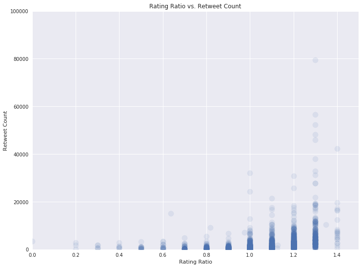

# ACT Report

## Introduction

This report serves as a documentation of analysis and insights into the final data. It shows that the cleaned data may be used for EDA and descriptive statistics, but also that not every single observation may be cleaned.

## Analysis

First we well look at the distribution of the rating ratio which was calculated dividing the `rating_numerator` column by `rating_denominator` in Pandas. Most ratings are slightly above 1.0 which confirms a lot of ratings like 12/10, 13/10, etc.

Looking at the distribution of favourite count, it turns out that the bulk of the distribution contains posts which were tagged as favouries less than 20.000 times. Only very few posts (~10^1) made to it over 100.000 favourites. Retweet count behaves quite similarly to favourite count.

The top-lists revealed interesting information about names and breeds. Cooper, Lucy and Charlie appeared most often in the list of dog names, followed by Oliver and Tucker on rank 2 and Penny on rank 3.

Following dog breeds appeared most often in the tweets:

Golden Retriever      156  
Labrador Retriever    106  
Pembroke               94  

Following Web Clients were used for posting:

Twitter for iPhone    1635  
Twitter Web Client      22  
TweetDeck                9  

Looking at the popularity of different breeds, the Golden Retriever wins the race having most favourites and retweets.

However, on average the Saluki and Bedlington Terrier win in terms of mean favourite count and retweets, respectively.

Looking at the relations between variables, it turns out that the rating moderately rises with favourite count (r=0.4) and retweet count (r=0.3). There is also a strong correlation between favourites and retweets (r=0.91).

Especicially the colored log-scale scatter-plot shows the multi-variate dependency between the three variables. The higher the different counts, the more color shifts into blue.

Fun facts:
The most retweeted dog is a nameless Labrador Retriever having a retweet count of 79515 and a rating of 13/10. The most liked dog in terms of favourite count is a Lakeland Terrier with a favourite count of 132810 and a rating of 13/10. These are truly good dogs. The dog with the highest rating ratio of 3.43 is a Golden Retriever that goes by the name Sam as - according to the text - she smiles 24/7... Whoopsi, who cleaned this dataset?

## Discussion

Cleaning the data resulted in a solid data set for analysis making it possible to create meaningful plots and perform exploratory data analysis. Even though the data set was thoroughly cleaned, some quality issues remain, which in the case of Sam were identified after cleaning during analysis. This example shows that data cleaning remains an iterative process.

## Conclusion

The cleaned data makes it possible to perform exploratory data analysis and descriptive statistics on the dataset. However, not every single line may be cleaned which becomes apparent during data analysis.